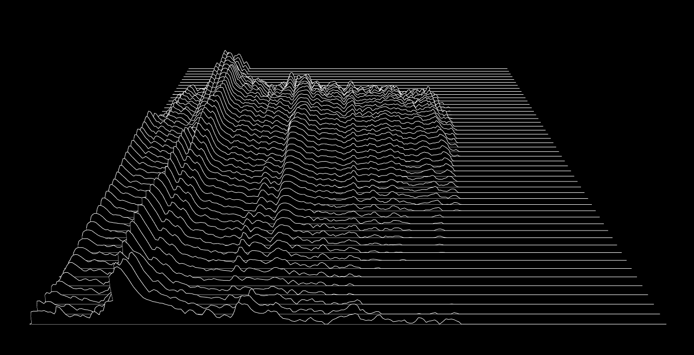

# Waterfall plot in Javascript 3D
**new**: Also check out the [WebGL Version](https://github.com/jo-m/waterfall-plot-webgl)!

Implements a moving [Waterfall Plot](https://en.wikipedia.org/wiki/Waterfall_plot) using [THREE.js](http://threejs.org/) and web audio. Currently works in Firefox and Chrome.

[Demo](https://jo-m.ch/repos/waterfall-plot/)

## Notes
* On Google Chrome, the webRTC API does not seem to work when you open local HTML files. So our old friend `python -m SimpleHTTPServer 8080` comes to help.* 
* THREE.JS really has one of the wost documentations I've seen in a long time
